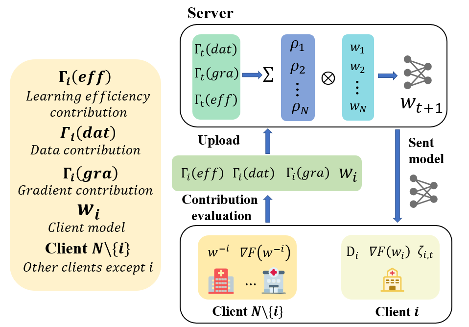

# TriAFL

This project provides a PyTorch implementation for the paper below.



> A Tri-Factor Adaptive Federated Learning Framework for Parkinson’s Disease Diagnosis via Multi-Source Facial Expression Analysis
> Meng Pang, Member IEEE, Houwei Xu, Zheng Huang, Yintao Zhou, Shengbo Chen, 
> Binghui Wang, Member IEEE, Wei Huang∗
>
> Abstract: *Early diagnosis of Parkinson’s disease (PD) is crucial for timely treatment and disease management. Recent studies link PD to impaired facial muscle control, manifesting as "masked face" symptoms, offering a novel diagnostic approach through facial expression analysis. However, data privacy concerns and legal restrictions have resulted in significant ``data silos", hindering data sharing and limiting the accuracy and generalizability of existing diagnostic models due to small, localized datasets. To address these challenges, we propose an innovative Tri-Factor Adaptive Federated Learning (TriAFL) framework, designed to collaboratively analyze facial expression data across multiple medical institutions while ensuring robust data privacy protection.*
> *TriAFL introduces a comprehensive evaluation mechanism that assesses client contributions across three dimensions: gradient, data, and learning efficiency, effectively addressing Non-IID issues arising from data size variations and heterogeneity. To validate the real-world applicability of our method, we collaborate with a hospital to build the largest known facial expression dataset of PD patients. Furthermore, we explore the integration of local data augmentation strategy to further enhance diagnostic accuracy. Comprehensive experimental results demonstrate TriAFL's superior performance over conventional FL methods in classification task, as well as confirms TriAFL's efficacy in PD diagnosis, delivering a rapid, non-invasive screening tool while driving advancements in AI-powered healthcare.*

## Directory Structure

```
dataset/       # Dataset
system/        # Main program & algorithm entry
flcore/        # Implementations of various federated learning algorithms
utils/         # Utility functions
records/       # Training results storage
```

## Environment Dependencies

- Python >= 3.7
- PyTorch >= 1.10
- torchvision
- numpy

It is recommended to create a virtual environment using Anaconda.

## Parameter Configuration

Key parameters include:

- `-algo`: Select algorithm (e.g., FedAvg, FedProx, FedBN)
- `-data`: Dataset name (e.g., mnist, Cifar10, har)
- `-mn`: Model name (e.g., cnn, resnet18, dnn)
- `-nb`: Number of classes
- `-nc`: Number of clients
- `-gr`: Global rounds (iterations)
- `-lbs`: Local batch size
- `-lr`: Local learning rate
  For a full list of parameters, see the argparse section in `main.py`.

## Training

The main program entry is `system/main.py`. Configure experiments via command-line arguments:

```bash
# Train using Cifar10 dataset with FedAvg
python main.py -data Cifar10 -mn resnet18 -algo FedAvg -gr 5000 -nb 10 -nc 20 -lbs 64 -eg 20 -lr 0.1
# Train using TriAFL (our method)
python main.py -data Cifar10 -mn resnet18 -algo FedRT -gr 10000 -nb 10 -nc 20 -lbs 64 -ww 2 -locs 1 -eg 5 -lr 0.05
```

## Output

Training logs and model parameters are automatically saved in the `records` folder. Supports statistics collection for multiple experimental runs.

## Citation

If you use this code in your research, please cite the original authors and link to this repository.

